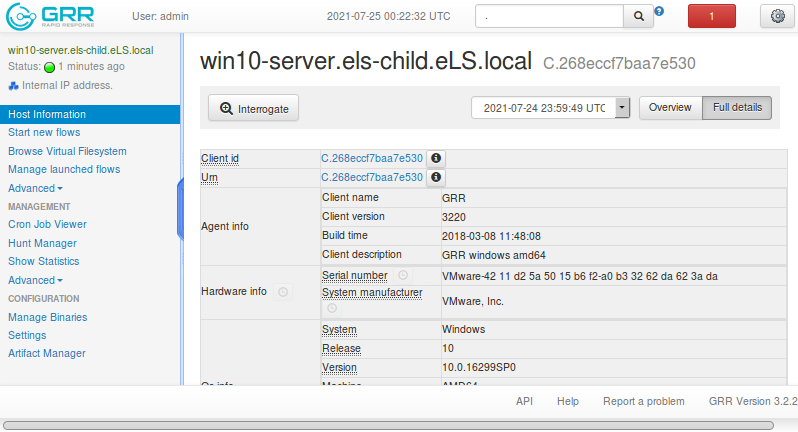
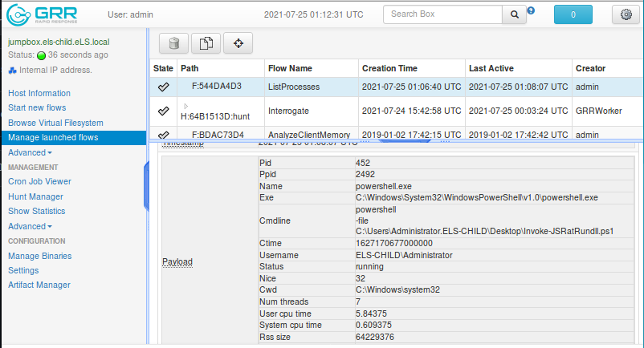

# List all the deployed GRR clients
+ Navigate to Search bar → Enter


	Note: wait until all the bullets turn green.
	
<hr>

# Gather basic information of machines
+ Click onto one machine → `Full details` 

  

<hr>

# GRR flows
#### Gather important information about the endpoint.

+ Network

1. Start new flows → Network → Netstat → Launch


+ To view the result:
	+ Manage launched flows → Netstat → Results


<hr>

# Abnormalities - Win10

+ Malicious process:  `rundll32.exe` is running javascript code


+ Persistence in registry: 

```bash
HKEY_LOCAL_MACHINE/SOFTWARE/Microsoft/Windows NT/CurrentVersion/SilentProcessExit/
```

+ Everytime the `calc.exe` process is terminated, the malicious piece of javascript code will be executed.


+ https://www.tanium.com/blog/another-persistence-method-reported-overnight-on-twitter-how-tanium-can-help/

<hr>

# Abnormalities - Win2012ServerR2
+ Suspicious processes.

1. Powershell RAT.




2. `cacl.exe` process.


+ Analyze `calc.exe` process memory with Rekall plugin
+ Start new flows → Memory → AnalyzeClientMemory → PLugin
	+ `Idrmodules`
	+ Args: `proc_regex` = calc.exe 


+ Why `System.Management.Automation.dll` is malicious in this situation?
	+ `System.Management.Automation.dll` is a DLL responsible for every PowerShell Operation. It means that there is a malicious PowerShell has been injected into `calc.exe`.

+ How the client got infected in the first place?
	+	There is a `.xlsx` in the client's `/Download` directory.
	+	Essentially, `.xlsx` file is effectively `.zip` files.
		+	Change file extension from `.xlsx` → `.zip`
		+ Extract and navigate to `xl` → `activeX` directory.
		+ Analyze the `activeX1.bin` using `xxd`,
		+ 

→ The `.xlsx` file contains Flash Application. Utilizing Flash vulnerability to obtain code execution.

<hr>

# Abnormalities - xubuntu
+ `/home/elsuser/Downloads` contains an executable `bleidi`.


+ Download and analyze the executable.
+ `strings bleidi`


+ It looks like this exploit code:


+ The attacker is trying to escalate his privilege.

<hr>

### Take away concepts

→ Always check running processes on the target. Especially the one with high privilege.

→ Always check network information since it'll tell us attacker traffic.  

→ Always check the registry, a go-to location for persistence.

→ Some common processes `notepad.exe` and `calc.exe` sometimes look benign. However, those are juicy target for attacker to inject malicious code.

→ `/Downloads`, `/tmp`, `/windows/temp`, `/dev/shm`, etc might reveal attacker artifacts.
